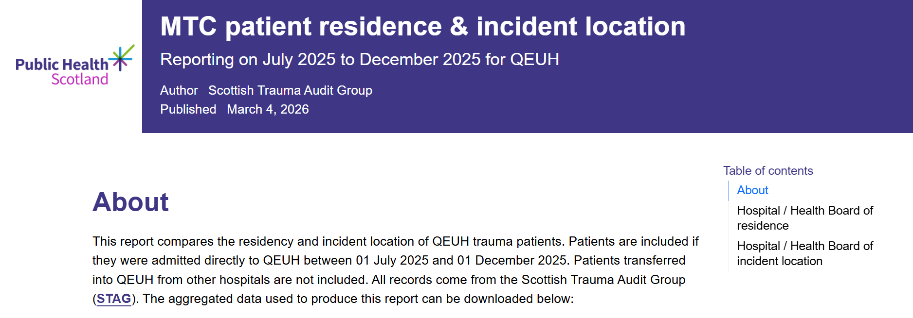
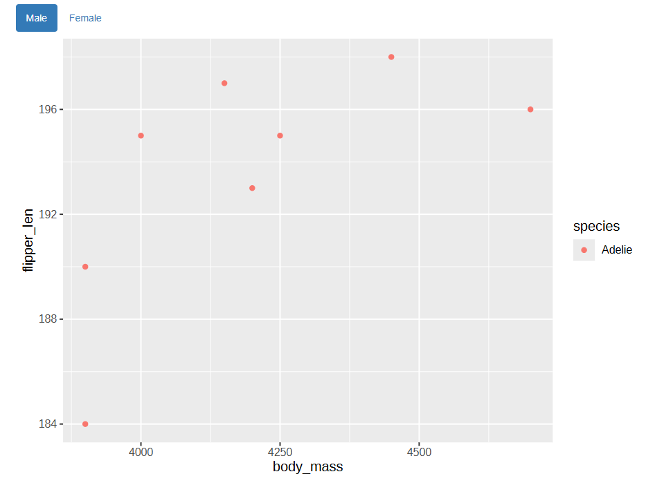
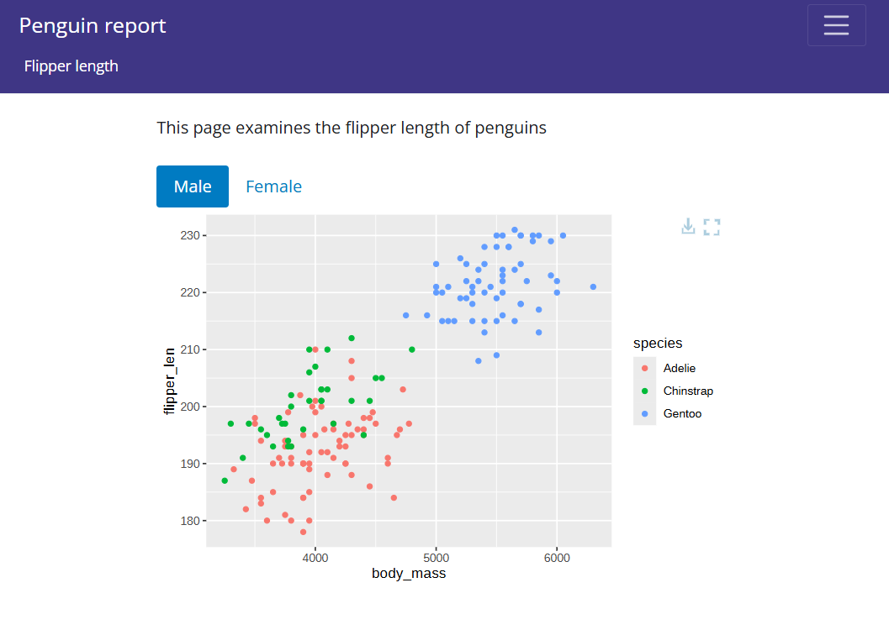

```{r eval=TRUE, echo=FALSE}
library(bslib)
library(dplyr)
library(ggplot2)
library(ggiraph)
library(DT)
```

## Context: Reporting Constraints in PHS

-   Shiny often blocked by hosting/governance.
-   Need attractive, lightweight HTML outputs.
-   Maintainability, reproducibility, and accessibility matter.

------------------------------------------------------------------------

## Dashboards vs Parameterised Reports  {.smaller}

::::: columns
::: {.column width="50%"}
{height="300"}
:::

::: {.column width="50%"}
-   Quickly communicate a variety of data at a glance
-   Monitor live or fast-changing statistics
:::
:::::

::::: columns
::: {.column width="50%"}
{height="300"}
:::

::: {.column width="50%"}
-   In-depth exploration of data
-   Can be be 'parameterised' (eg. batching per board/site)
:::
:::::
------------------------------------------------------------------------

## Parameterised reports with `quarto` and `rmarkdown` {.smaller}

- Very similar!  
- Why use `quarto`?
    -   modern features by default
    -   long-term support
    -   multi-language
    -   reusable assets (brand, includes, metadata).
- **However** `quarto` is still a work in progress
    -   support for some packages, including `bslib`, is patchy
    -   `rmarkdown` is sometimes better documented

------------------------------------------------------------------------

## Customising Quarto/RMd {.smaller}

### YAML Essentials

#### Quarto

::::: {.columns}

::: {.column width="70%"}
```{yaml}
title: Penguin report
subtitle: `r paste(params$location, params$year)`
format:
  html:
    toc: true                 # <1>
    self-contained: true      # <2>
execute:                      # <3>
  echo: false                 # <3>                 
  message: false              # <3>  
  warning: false              # <3>
params:                       # <4>
  location: "Torgersen"       # <4>       
  year: 2008                  # <4>       
```

1. Table of contents (further options can control position and appearance)
2. Export as **standalone** `.html` file
3. Whether to include source code and error messages in output
4. Parameters! Access these anywhere with `params$...`
:::

:::::

------------------------------------------------------------------------

## Customising Quarto/RMd {.smaller}

### YAML Essentials

#### RMd

::::: {.columns}

::: {.column width="70%"}
```{yaml}
title: Penguin report
subtitle: `r paste(params$location, params$year)`
format:
  html:
    toc: true                 # <1>
    self-contained: true      # <2>
knitr:                        # <3>
  opts_chunk:                 # <3>
    echo: false               # <3>                 
    message: false            # <3>  
    warning: false            # <3>
params:                       # <4>
  location: "Torgersen"       # <4>       
  year: 2008                  # <4>       
```

1. Table of contents (further options can control position and appearance)
2. Export as **standalone** `.html` file
3. Whether to include source code and error messages in output
4. Parameters! Access these anywhere with `params$...`
:::

:::::

------------------------------------------------------------------------

## Customising Quarto/RMd {.smaller}

### CSS / HTML

-   Small CSS tweaks can be added anywhere, e.g.:

```{css}
.small-text{
  font-size: 50%  
}
```

-   HTML partials for headers/footers/notice blocks.
-   Organising styles for reuse across reports:
    -   CSS stylesheet
    -   Quarto supports brand YAML

------------------------------------------------------------------------

## Example {.smaller}

{width=100%, fig-align="center"}

```{yaml}
title: MTC patient residence & incident location
subtitle: "`r paste('Reporting on', params$from, 'to', params$to, 'for', params$hospital)`"
date: "`r format(Sys.Date(), '%d %B %Y')`"
author: "Scottish Trauma Audit Group"
params:
  hospital: "QEUH"
  from: "July 2025"
  to: "December 2025"
format:
  html:
    toc: true
    template-partials: 
      - _extensions/banner-with-img/title-block.html
css: _extensions/phs-html-quarto/phs_style.css
```


------------------------------------------------------------------------

## UI Components {.smaller}

`bslib` package can give the “feel” of a Shiny app to a static document.

For example, navs can be used for plots by variable (in lieu of responsive inputs):

::::: {.columns}

::: {.column width="50%"}

```{r}
my_plot <- function(sx){
  girafe(
    filter(penguins, sex == sx) |>
      ggplot(aes(body_mass, flipper_len)) +
      geom_point()
  )
}

navset_pill(
  nav_panel("Male", 
            card_body(
              fillable=FALSE,
              my_plot("male"))
  ),
  nav_panel("Female",
            card_body(
              fillable=FALSE,
              my_plot("female"))
  )
)
```

:::

::: {.column width="50%"}


:::
::::

------------------------------------------------------------------------

## Interactive Visuals: `ggiraph` (vs `plotly`)

-   Why `ggiraph`?
    -   Lightweight SVG output.
    -   R no longer officially supported for Plotly.
    -   Easier to customise and control (no messing around with `JS`)

-----------------------------------------------------------------------

## Example {.smaller}

::::: {.columns}

::: {.column width="70%"}
```{r eval=TRUE}
plot <- ggplot(
  penguins,
  aes( x= body_mass, y = flipper_len, colour = species,
       tooltip = paste0(               # <1>
         "Sex: ", sex,                 # <1>
         "</br>Location: ", island     # <1>
       ))) +
  geom_point_interactive() +           # <2>
  theme_light()                        # <3>

girafe(plot)                           # <4>
```

1.  Tooltip can be a variable, string, or `glue` function
2.  Most `ggplot2` geoms have an `_interactive` variant
3.  Unlike `plotly`, `ggplot2` themes work without issues
4.  Call `girafe()` to turn any `ggplot` object into an SVG widget
:::

::::
------------------------------------------------------------------------

## Interactive Tables: `DT` + Extensions {.smaller}

-   `DT` extensions give more options for search, filtering, and export buttons.
-   E.g. `SearchPanes` extension:
```{r}
penguins |>
  datatable(extensions = c('Select', 'SearchPanes'),
              selection = 'none',
              rownames = FALSE,
              options = list(dom = 'Prtip',
                             searchPanes = list(
                               controls = FALSE,
                               viewCount = FALSE
                             ),
                             columnDefs = list(
                               list(searchPanes = list(show = FALSE),
                                    targets = 2:6)
                             ))
            )
```
------------------------------------------------------------------------

## Interactive Tables: `DT` + Extensions {.smaller}

```{r eval=true, echo=FALSE}
penguins |>
  datatable(extensions = c('Select', 'SearchPanes'),
              selection = 'none',
              rownames = FALSE,
              options = list(dom = 'Prtip',
                             searchPanes = list(
                               controls = FALSE,
                               viewCount = FALSE
                             ),
                             columnDefs = list(
                               list(searchPanes = list(show = FALSE),
                                    targets = 2:6)
                             ))
            )
```

------------------------------------------------------------------------

## Breaking Free of Markdown

-   Possible to build HTML UIs with just `bslib` and `htmltools` (no `quarto` or `rmarkdown`).
```{r}
page_fluid(
  H1("Penguins"),
  card(
    datatable(penguins)
  )
)
```

-   Allows more complex layouts, multiple pages, etc
-   Trade‑offs: control vs authoring convenience.

------------------------------------------------------------------------

## Example {.smaller}

::::: {.columns}

::: {.column width="50%"}
```{r}
# pages
flipper_length <- nav_panel(
  "Flipper length",
  layout_columns(
    col_widths = breakpoints(xs = c(-2,8,-2), xxl = c(-3,6,-3)),
    "This page examines the flipper length of penguins",
    navset_pill(
      nav_panel("Male", 
                card_body(
                  fillable=FALSE,
                  my_plot("male"))),
      nav_panel("Female",
                card_body(
                  fillable=FALSE,
                  my_plot("female")))
    ))
  )

# report
page_navbar(
  title = "Penguin report",
  fillable = FALSE,
  navbar_options = navbar_options(
    bg = "#3F3685"
  ),
  flipper_length
)
```
:::

::: {.column width="50%"}

:::

::::
------------------------------------------------------------------------

## Saving Standalone HTML from R {.smaller}

-   Exporting self‑contained HTML outputs can be fiddly...
-   Images need to be encoded in base64
```{r}
img_base64 <- function(path, ...) {
  base64 <- base64enc::dataURI(file = path, mime = "image/png")
  htmltools::tags$img(src = base64, ...)
}
```
-   Fonts should be bundled to ensure consistency
```{r}
gdtools::addGFontHtmlDependency(family = "Open Sans")
```
-   `htmlwidgets::saveWidget()` works in some cases, but I have a custom `save_self_contained_html()` function that I'm happy to share
